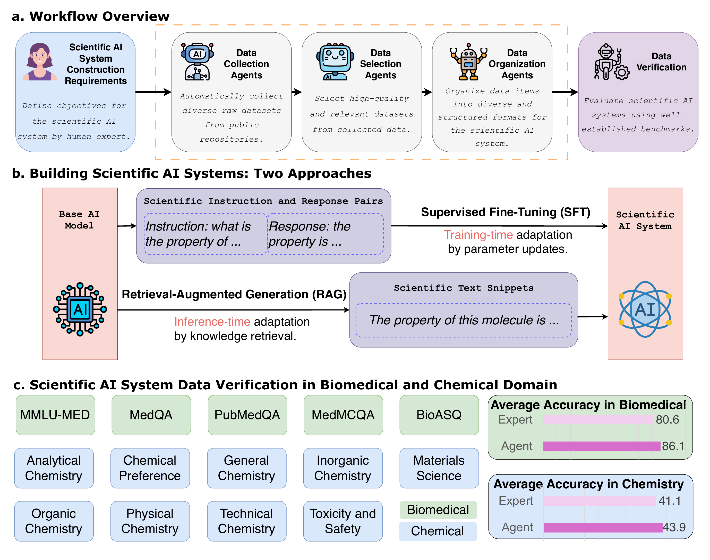
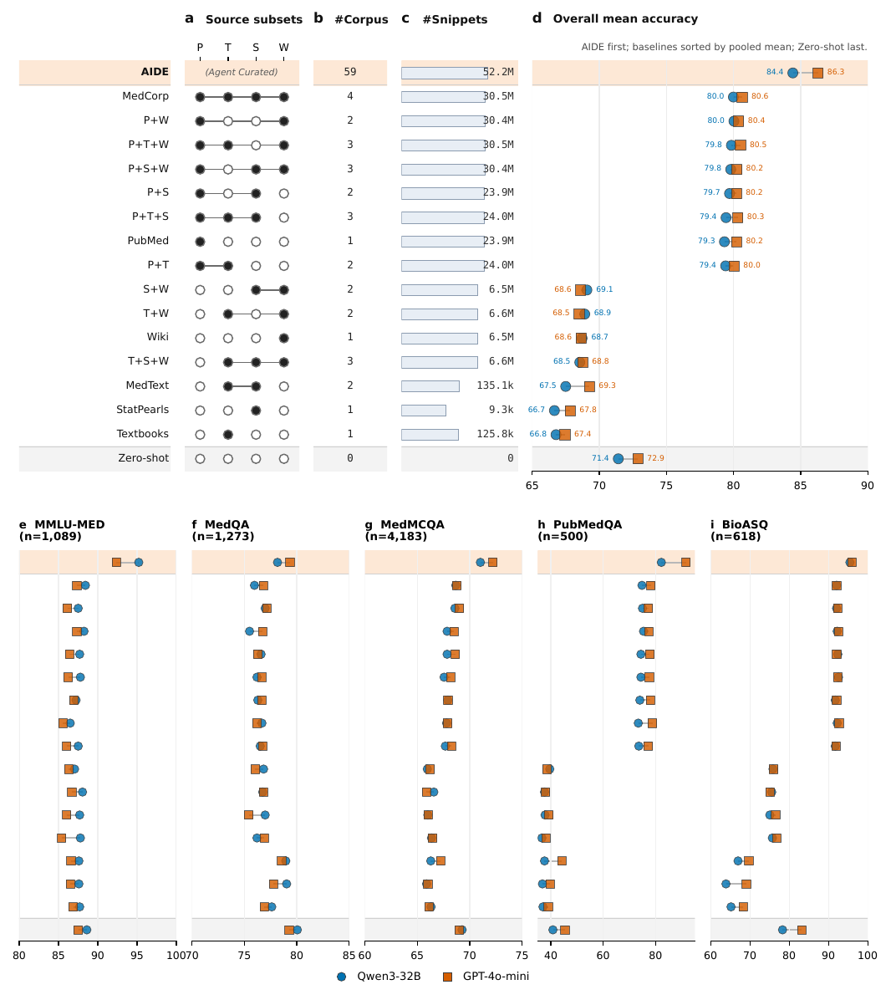
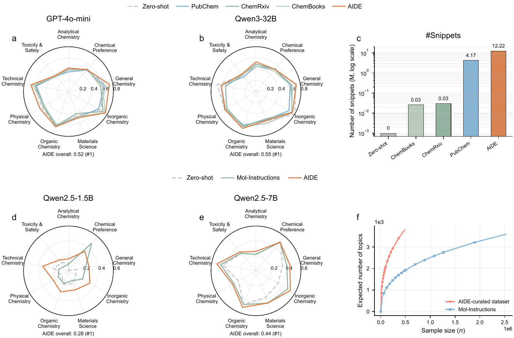

# AIDE

Agentic Intelligent Data Engine for Scientific Large Language Models.


<p align="center">
  
</p>

AIDE curates scientific datasets for large language model development. Given a
natural-language data requirement, it searches for candidate Hugging Face
datasets, selects useful datasets with an LLM quality gate, and organizes the
selected data into instruction-response examples or retrieval corpora.

This repository is the code release for the paper *Agentic Intelligent Data
Engine for Scientific Large Language Models* (Xie et al., *Nature
Communications*, accepted 2026). The data curated for the paper are archived on
Zenodo at [10.5281/zenodo.20319939](https://doi.org/10.5281/zenodo.20319939).

<p align="center">
  
</p>

*Figure 1 of the paper. Human experts state the requirement; data collection,
selection, and organization agents produce the corpus; downstream systems are
built by supervised fine-tuning or retrieval-augmented generation and verified
on established benchmarks.*

## Results at a Glance

Headline numbers from the paper. AIDE was given a one-sentence data
requirement and ran without human intervention; the resulting corpora were then
plugged into a fixed downstream pipeline and compared with expert-curated
alternatives.

| Setting | AIDE-curated data | Comparison |
| --- | --- | --- |
| Biomedical RAG, mean accuracy over MMLU-MED, MedQA, MedMCQA, PubMedQA, BioASQ | 86.3% (GPT-4o-mini), 84.4% (Qwen3-32B) | 72.9% / 71.4% without retrieval; best of all 15 unions of the MIRAGE expert corpora on both backbones |
| Biomedical retrieval corpus | 59 sources, 52.2M snippets | MedCorp (PubMed + StatPearls + Textbooks + Wiki): 4 sources, 30.4M snippets |
| Chemistry SFT, ChemBench accuracy with Qwen2.5-7B | Higher accuracy on 7 of 9 subtasks, comparable on the other 2 | Mol-Instructions (expert-curated, 1.5M samples); AIDE data are 0.23M samples with 193 more distinct topic tags |
| Chemistry RAG, ChemBench overall accuracy | 0.52 (GPT-4o-mini), 0.55 (Qwen3-32B) | 0.51 / 0.54 without retrieval; best of the three external chemistry corpora tested |
| Wall-clock time for a curation run of about 60 datasets | 1 to 4 days, of which 1.1 to 2.3 hours are LLM API time | More than 14 working weeks by the median estimate of 13 surveyed domain experts |

<p align="center">
  
</p>

*Figure 4 of the paper. Biomedical RAG accuracy for the AIDE corpus (top row),
the 15 unions of the four MIRAGE expert corpora, and the no-retrieval baseline
(bottom row), with Qwen3-32B (circles) and GPT-4o-mini (squares).*

<p align="center">
  
</p>

*Figure 5 of the paper. ChemBench accuracy by subtask for retrieval (a-c) and
fine-tuning (d-f); panel f shows the number of distinct topics as a function of
sample size for the AIDE-curated and Mol-Instructions datasets.*

Per-benchmark results, ablations, and the comparison with general-purpose
coding agents are in the paper and its Supplementary Information.

## Install

```bash
git clone https://github.com/bjzgcai/AIDE
cd AIDE
uv sync
```

Python 3.11 or newer is required.

## Offline Check

Run the local demo before using external services:

```bash
uv run aide-demo --output-dir outputs/demo
uv run python -m unittest discover -s tests
```

The demo writes a small synthetic curation run under `outputs/demo/` and does
not require API keys or network access.

## Configure Models

AIDE uses an OpenAI-compatible chat endpoint.

```bash
cp .env.example .env
```

Edit `.env`:

```dotenv
LLM_API_KEY=your-openai-compatible-api-key
LLM_API_BASE=https://api.openai.com/v1
LLM_EXTRA_BODY_JSON=
HF_TOKEN=
```

`HF_TOKEN` is optional for public Hugging Face datasets, but can help with rate
limits.

## Run AIDE

RAG corpus curation:

```bash
uv run aide-curate --config configs/smoke_biomedical_rag.yaml
```

Instruction-data curation:

```bash
uv run aide-curate --config configs/smoke_chemistry_instruction.yaml
```

The smoke configs keep dataset search and processing small. Use
`configs/biomedical_rag.yaml` or `configs/chemistry_instruction.yaml` as
starting points for larger runs.

## Outputs

Runs write artifacts under `outputs/`, including selected datasets, generated
processors, organized data, logs, and optional stage metrics. Generated files are
kept so that each curation decision can be inspected.

Instruction runs produce per-task `train.json` files. To export instruction and
output JSONL pairs:

```bash
uv run aide-dedup \
  --input-dir outputs/<run-dir> \
  --train-output outputs/<run-dir>/instruction_train.jsonl \
  --val-output outputs/<run-dir>/instruction_val.jsonl \
  --summary-path outputs/<run-dir>/dedup_summary.txt \
  --seed 0 \
  --force
```

## Reproducing the Paper

AIDE produces the data; the downstream evaluations use external tools. The
table maps each reported result to the curation run that produced its data,
the archived artefact, and the evaluation setup.

| Paper result | Curation run | Archived data (Zenodo) | Evaluation |
| --- | --- | --- | --- |
| Biomedical RAG (Fig. 4, Supplementary Tables 2 and 3) | `configs/biomedical_rag.yaml` | `*_rag.jsonl` files in the record root, one per selected dataset (58 files plus the 40-part Healix-Shot archive) | [MedRAG](https://github.com/gzxiong/MedRAG) with a Lucene BM25 index, top 25 snippets per query, temperature 0; backbones GPT-4o-mini and Qwen3-32B (thinking mode off) |
| Corpus refresh to a later knowledge cut-off (Fig. 7) | Same config, retrieval index restricted to datasets available up to 2022 or up to 2025 | Same files | Same MedRAG setup |
| Chemistry RAG (Fig. 5a-c, Supplementary Table 5) | Same pipeline with `organization_format: rag` and a chemistry requirement | `chemistry.tar.zst`, folder `chem_rag/` | Same MedRAG setup, evaluated on [ChemBench](https://github.com/lamalab-org/chembench) |
| Chemistry SFT (Fig. 5d-f, Supplementary Table 6) | `configs/chemistry_instruction.yaml`, then `aide-dedup` | `chemistry.tar.zst`, folder `chem_sft/` | Fine-tune Qwen2.5-1.5B and Qwen2.5-7B with [DeepSpeed](https://github.com/deepspeedai/DeepSpeed): learning rate 1e-6, batch size 1024, 500 steps, generation temperature 0; evaluated on ChemBench |

### Re-running the curation

```bash
uv run aide-curate --config configs/biomedical_rag.yaml
uv run aide-curate --config configs/chemistry_instruction.yaml
```

Each full run took roughly one day of wall-clock time in the paper (about
2.3M LLM tokens for the biomedical run and 5.8M for the chemistry run). Note
that Hugging Face Hub search results and dataset contents change over time, so
a new run will not select exactly the same datasets; the Zenodo record preserves
the outputs used in the paper.

### Downloading the archived data

The record is about 100 GB in total. Download individual files from
<https://zenodo.org/records/20319939>, or fetch everything with
[zenodo_get](https://github.com/dvolgyes/zenodo_get):

```bash
pip install zenodo_get
zenodo_get 10.5281/zenodo.20319939
```

Two artefacts need unpacking:

```bash
# Healix-Shot is split into 40 zstd parts
cat health360_Healix-Shot_default_rag.jsonl.zst.part* | zstd -d -o health360_Healix-Shot_default_rag.jsonl

# Chemistry corpora
tar --zstd -xf chemistry.tar.zst
```

Layout of the record:

| Path | Contents |
| --- | --- |
| `*_rag.jsonl` (record root) | Biomedical retrieval corpus, one file per selected Hugging Face dataset (59 datasets; PubMed alone is 35 GB) |
| `chemistry.tar.zst` -> `chem_rag/` | Chemistry retrieval corpus, one `*_rag.jsonl` file per selected dataset (59 datasets) |
| `chemistry.tar.zst` -> `chem_sft/` | The deduplicated chemistry instruction-tuning set used for fine-tuning, as a single JSONL file |

Every `*_rag.jsonl` file holds one JSON object per line with `id` and
`contents` fields, which is the input format expected by the MedRAG indexer.

## Configuration

Common fields:

| Field | Purpose |
| --- | --- |
| `prompt` | Natural-language data requirement. |
| `organization_format` | `instruction` or `rag`. |
| `selection_model` | Model used for dataset selection. |
| `organization_model` | Model used for data organization. |
| `max_results_per_term`, `max_datasets` | Bounds for dataset search. |
| `instruction_max_items_per_dataset` | Item cap for instruction runs. |
| `rag_max_items_per_dataset` | Item cap for RAG runs. |

See [docs/configuration.md](docs/configuration.md) for the full configuration
reference and [docs/end_to_end.md](docs/end_to_end.md) for live smoke tests.

## Development

```bash
uv sync --extra dev
uv run ruff format --check .
uv run ruff check src tests
uv run pytest -q
```

## Citation

If you use AIDE in research, please cite the paper:

```bibtex
@article{xie2026aide,
  title   = {Agentic Intelligent Data Engine for Scientific Large Language Models},
  author  = {Xie, Shufang and Liu, Zequn and Deng, Pan and Luo, Renqian and Xia, Yingce and Qin, Tao and Yan, Rui},
  journal = {Nature Communications},
  year    = {2026},
  note    = {in press}
}
```

The curated data are archived on Zenodo at
[10.5281/zenodo.20319939](https://doi.org/10.5281/zenodo.20319939).
